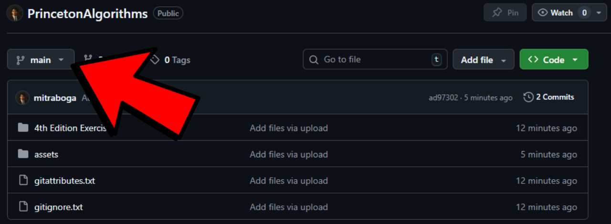
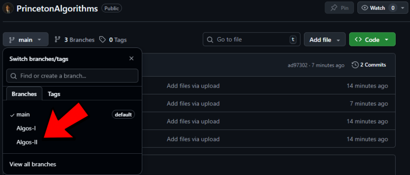

  

---

## How to Navigate the Branches

1. Click the branch switch tab in the top-left corner of the repository page.
   **

2. Select the desired branch corresponding to Princeton Algorithms I and/or Princeton Algorithms II.
   **

## Object-Oriented Programming in Java: Professor Testimonial

  

---

This library contains my assessments, exercises, and object-oriented programming using Java to enhance my Data Structures and Algorithms (DSA) skills via the renowned Princeton Algorithms Course(s)!
